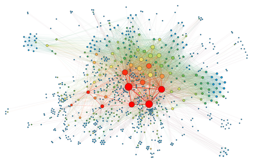
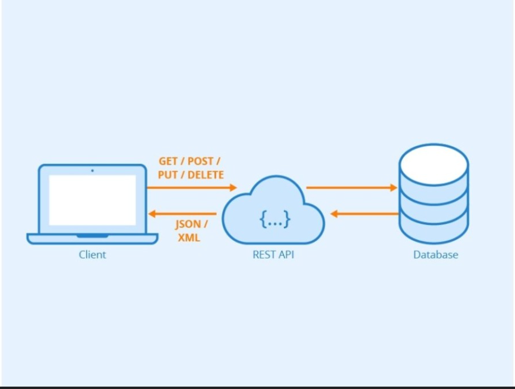

# MappedJobs
## Presentation
The goal is to display job offers around Paris in a force directed-graph in a 2D space.
Example :


The data will be from OpenData:
[OpenData reference](https://www.data.gouv.fr/datasets/offres-demploi-de-la-region-ile-de-france)


## Workflow

 1. ***Docker*** to create a ***PostgresQL*** database
 2. Creation of the ingestion script in python to get data from ***API***
 3. Data transforation with ***DBT***
 4. Orchestration of 2. and 3. with ***Airflow***
 5. Interface with streamlit

## 1. Docker-compose for database

First we select last updates of docker-compose and postgresql:

- [Docker compose version](#https://github.com/docker/compose/releases
)
- [Postgresql Version](https://www.postgresql.org/docs/14/app-initdb.html)

Security: I want to create a secured env so i dont want password in plain text. Password will be stored in .env and .env is added to .gitignore

## 2. Postgresql Database and api
### postgresql init
First we install these in our .venv:
- requests -> send HTTP requests (SEND, POST) to the website
- pandas -> transform data
- sqlalchemy --> Object translate df transformation to sql
- psycopg2-binary --> PostgreSQL database adapter for the Python 

Then i add it to requirements:
````pip freeze > requirements.txt```` in terminal

- [sql alchemy](https://docs.sqlalchemy.org/en/20/core/engines.html) : Engine will do the translation between python to postgresql SQL database

With this code we can insert an abritary dataset in the database:

### API (Application Programming Interface)
An API is a bridge between a Client and a Servor.

#### API REST
According to Google:
    A REST API is an API that follows the design principles of the REST architectural style. The basic principle of REST is the notion of resources, which can correspond to any element of information, such as a user, a product, a document or a collection of elements
Explanation:
It works with HTTP protocol:
| Element | Role | Practical Example |
| :--- | :--- | :--- |
| **URL** (Endpoint) | The unique address identifying the resource. | `https://api.meteo.fr/v1/predict` |
| **Method** (Verb) | Defines the type of action to be performed. | `GET`, `POST`, `PUT`, `DELETE` |
| **Headers** (Metadata) | The "envelope": contains Auth tokens and data types. | `Authorization: Bearer <token>` |
| **Body** (Payload) | The raw content (often JSON). Where your data lives. | `{"features": [5.1, 3.5, 1.4, 0.2]}` |

#### Security Protocol

To exchange data we use a special protocol the ***OAuth2***
1. Identification: The client (Me) holds a Client ID and a Client Secret (private key).

2. The Gateway (/token): I sent those called ***credentials*** to a specific route on the API, usually called the /token endpoint.

3. The Token (Access Token): After verification, the API issues a temporary Access Token (typically a JWT - JSON Web Token).

4. The Secured Call: For every subsequent prediction request, i include this token in the Authorization Header.


## Change of API --> using france travail
[rules](https://francetravail.io/produits-partages/documentation/conditions-dutilisation-api/licence-offres-emploi)
[portal](https://authentification-partenaire.francetravail.io/connexion/XUI/?realm=/partenaire&goto=https://authentification-partenaire.francetravail.io/connexion/oauth2/realms/root/realms/partenaire/authorize?realm%3D/partenaire%26response_type%3Dcode%26client_id%3DPAR_PN109-PEIO_7F2253D7E228B22A08BDA1F09C516F6FEAD81DF6536EB02FA991A34BB38D9BE8%26scope%3Dapplication_PAR_PN109-PEIO%2520email%2520openid%2520peiofront%2520sldng%2520profile%26redirect_uri%3Dhttps://francetravail.io/auth/auth.html%26state%3DnQ3GvTYDaSGZ2J_nYWdahA%26nonce%3D0U4bD9wir7elLGN3jUS2Lg#login/)
[Utilisation](https://francetravail.io/produits-partages/documentation/utilisation-api-france-travail)

Royaume : "https://api.francetravail.io/partenaire/offresdemploi"

## Directories